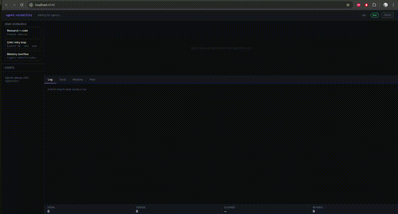

# 🔍 MAVT — Multi-Agent Visibility Tool

> The missing DevTools for multi-agent AI systems.

[](https://pypi.org/project/mavt/)
[](LICENSE)
[](https://github.com/hit1001/multiagent-visibility-tool/stargazers)



**You wouldn't ship a backend without logs. Why are you shipping agents blind?**

Multi-agent systems are the future of AI — but right now, debugging them feels like
reading smoke signals. MAVT gives you full observability: every agent call, every
decision step, every inter-agent message, visualized in real time.

---

## The problem

You build a multi-agent workflow. Something breaks. You ask yourself:

- Which agent failed — and why?
- What did agent A actually say to agent B?
- Where in the chain did the task go wrong?
- Why is this running so slow?

You open your terminal. You see... nothing useful.

**MAVT fixes this.**

---

## What you get

| | |
|---|---|
| 🔁 **Agent-to-agent traces** | See every message passed between agents, in order |
| 🧠 **Decision step inspector** | Understand what reasoning led to each action |
| 📊 **Live workflow graph** | Visual execution graph, updating in real time |
| ⏱ **Execution timeline** | Spot bottlenecks and latency across your pipeline |
| 🐛 **Real-time debug view** | No post-hoc log parsing — watch it live |

---

## Get started in 60 seconds

```bash
pip install mavt
```

```python
from mavt import track_agents

track_agents()  # That's it.
```

Open your browser → `http://localhost:7777`

Your agents are now fully observable.

---

## Works with

- ✅ **AgentScope** — supported now
- 🔜 **LangChain** — coming soon
- 🔜 **AutoGen** — coming soon  
- 🔜 **CrewAI** — coming soon
- 🔜 **Custom agents** — bring your own

---

## Why observability is non-negotiable

> *"If you can't measure it, you can't manage it."*

AI agents are making real decisions in production systems today — in customer service,
in code generation, in enterprise workflows. Without visibility:

- You can't debug failures
- You can't trust outputs
- You can't scale safely
- You can't explain decisions to stakeholders

MAVT is the foundation layer your agent stack is missing.

---

## Roadmap

- [x] AgentScope integration
- [x] Live workflow graph
- [x] Agent-to-agent message tracing
- [ ] LangChain integration
- [ ] AutoGen integration
- [ ] CrewAI integration
- [ ] Metrics & cost tracking per agent
- [ ] Export traces to JSON / OpenTelemetry
- [ ] Cloud-hosted dashboard (optional)

---

## Contributing

Issues, PRs, and framework integrations are very welcome.
If you're using MAVT with a framework not listed above — open an issue and let's add it.

---

## Star history

If MAVT saves you a debugging session, consider leaving a ⭐ —
it helps other developers find the tool.

---

## About the author

Built by [Hitarth Bhatt](https://github.com/hit1001) — AI product leader with 10+ years
shipping AI systems at scale. MAVT grew out of a real frustration: the more powerful
multi-agent systems become, the harder they are to see inside.

---

**MIT License** · [PyPI](https://pypi.org/project/mavt/) · [Issues](https://github.com/hit1001/multiagent-visibility-tool/issues)
